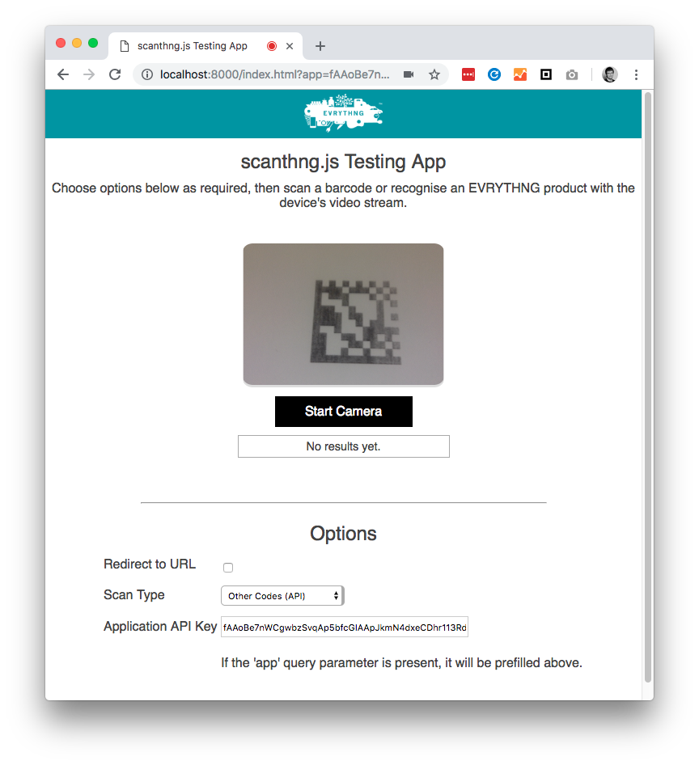

# scanthng-test-app

### See a [Live Demo](http://scanthng-demo.evrythng.io)

Testing example app for 
[`scanthng.js`](https://github.com/evrythng/scanthng.js) in the stream scanning 
mode, allowing you to test scanning many kinds of barcodes on product packaging,
including non-barcode image recognition functionality.

## Setup

1. Clone this repository.
2. Deploy to a web server, or run locally with `npm run serve`.

## Usage

1. Open the page.
2. Enter an Application API Key from an EVRYTHNG application into the Options
   section, or specify with the `app` query parameter.
3. Click 'Start Camera' to begin scanning a stream with the set options. You can
   change the options and click this button again to apply them.
4. Place a QR code or other kind of barcode in front of the camera to see the
   output from the SDK. If the 'Redirect to URL' option is set, the browser will
   automatically follow that URL.

## Configuration

The options allow you to control the behavior of the app:

* Whether or not to redirect to a scanned URL when it is found.
* The scanning type (native QR code, API-based barcode, or image recognition)
* The Application API Key (required) that is used to initialise the SDK.
